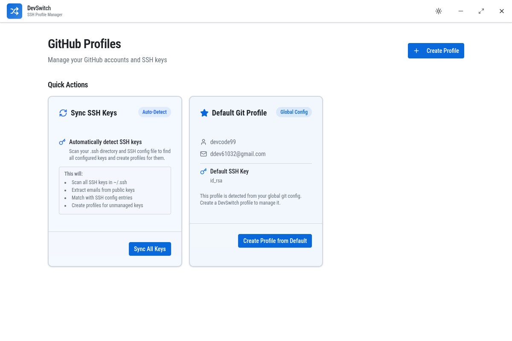
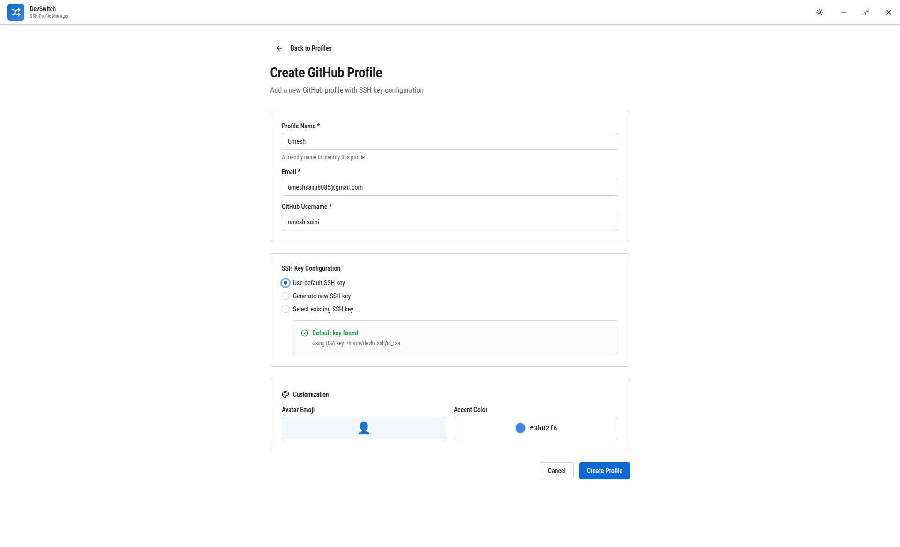
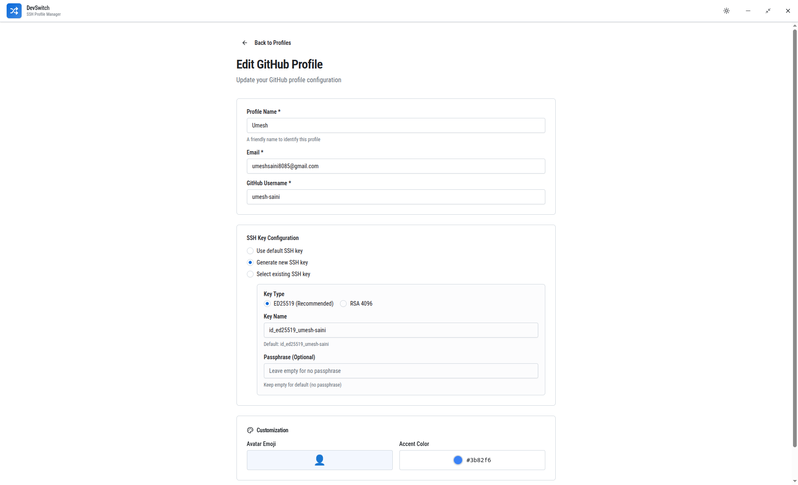
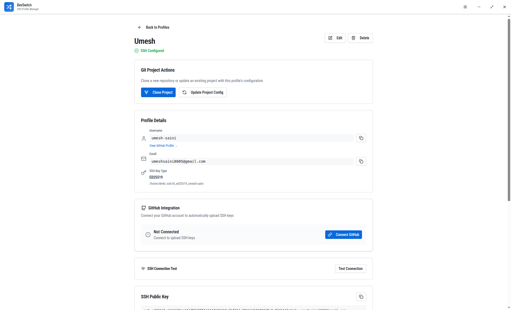

# DevSwitch 🔑

<div align="center">
  
  
  
  **A powerful desktop application for managing multiple Git profiles and SSH keys**
  
  [](https://www.electronjs.org/)
  [](https://reactjs.org/)
  [](https://www.typescriptlang.org/)
  [](https://tailwindcss.com/)

</div>

---

## 📋 Table of Contents

- [Overview](#-overview)
- [Features](#-features)
- [Screenshots](#-screenshots)
- [Installation](#-installation)
- [Usage](#-usage)
- [Architecture](#-architecture)
- [Tech Stack](#-tech-stack)
- [Development](#-development)
- [Building](#-building)
- [Contributing](#-contributing)
- [License](#-license)

---

## 🎯 Overview

**DevSwitch** is a cross-platform desktop application built with Electron and React that simplifies the management of multiple Git profiles and SSH keys. Whether you're a developer juggling personal and work accounts, or managing multiple client projects, DevSwitch streamlines SSH key generation, configuration, and profile switching.

### Why DevSwitch?

- 🔐 **Secure SSH Key Management** - Generate, import, and manage SSH keys with passphrase encryption
- 🎭 **Multiple Profiles** - Switch between different Git accounts effortlessly
- ⚙️ **Auto-Configuration** - Automatically updates SSH config files with proper host aliases
- 🔄 **Smart Sync** - Scan and sync existing SSH keys into profiles automatically
- 🎨 **Beautiful UI** - Modern, responsive interface with dark/light theme support
- 🖥️ **Cross-Platform** - Works on Windows, macOS, and Linux

---

## ✨ Features

### 🔑 SSH Key Management

<details>
<summary><b>Generate New SSH Keys</b></summary>

- **Multiple Algorithms**: Support for ED25519 and RSA key generation
- **Passphrase Protection**: Optional passphrase encryption for enhanced security
- **Custom Naming**: Name your keys for easy identification
- **Automatic Registration**: Keys are automatically added to ssh-agent
- **Public Key Export**: Easy access to public keys for platform registration

</details>

<details>
<summary><b>Import Existing Keys</b></summary>

- **File Browser**: User-friendly file picker to select existing SSH keys
- **Default Key Detection**: Automatically detects common SSH key locations (~/.ssh/id_ed25519, id_rsa)
- **Validation**: Ensures selected keys are valid SSH private keys
- **Preserve Configuration**: Maintains existing SSH config entries

</details>

<details>
<summary><b>Auto-Sync Feature</b></summary>

- **Scan SSH Directory**: Automatically scans ~/.ssh for all SSH keys
- **Parse SSH Config**: Reads existing SSH config file to find configured keys
- **Email Extraction**: Extracts email addresses from public key comments
- **One-Click Sync**: Creates profiles for all unmanaged SSH keys automatically
- **Conflict Prevention**: Skips keys that are already managed to avoid duplicates

</details>

### 👤 Profile Management

<details>
<summary><b>Create Profiles</b></summary>

- **Profile Information**: Name, username, and email for each Git account
- **SSH Key Options**:
  - Use default SSH key (id_ed25519 or id_rsa)
  - Generate a new SSH key
  - Import an existing SSH key
- **Visual Feedback**: Real-time validation and error handling
- **Quick Actions**: Create from default Git configuration

</details>

<details>
<summary><b>Edit & Update Profiles</b></summary>

- **Modify Details**: Update profile name, username, and email
- **Change SSH Keys**: Switch between different SSH keys
- **Regenerate Keys**: Generate new keys for existing profiles
- **View SSH Config**: See the generated SSH host configuration
- **Copy Public Keys**: One-click copy to clipboard for platform registration

</details>

<details>
<summary><b>Delete Profiles</b></summary>

- **Safe Deletion**: Confirmation dialog prevents accidental deletions
- **SSH Config Cleanup**: Automatically removes SSH config entries
- **Key Preservation**: Option to keep or delete generated SSH key files
- **Profile Isolation**: Deletion doesn't affect other profiles

</details>

### ⚙️ SSH Configuration

<details>
<summary><b>Automatic SSH Config Management</b></summary>

- **Host Alias Generation**: Creates unique host aliases (e.g., github.com-username)
- **IdentityFile Mapping**: Links SSH keys to specific Git platform hosts
- **Config File Updates**: Safely modifies ~/.ssh/config without breaking existing entries
- **Backup & Recovery**: Preserves existing configuration
- **Format Preservation**: Maintains proper SSH config formatting

</details>

### 🔄 Git Integration

<details>
<summary><b>Global Git Config Detection</b></summary>

- **Auto-Detection**: Reads global Git username and email configuration
- **Quick Profile Creation**: Pre-fills profile forms with Git config data
- **Default Profile Card**: Suggests creating a profile from current Git setup
- **Sync Validation**: Shows Git config before syncing for verification

</details>

### 🔗 GitHub OAuth Integration

<details>
<summary><b>Connect GitHub Accounts</b></summary>

- **OAuth Flow**: Secure GitHub OAuth 2.0 authentication
- **Account Linking**: Connect GitHub accounts to profiles
- **Auto SSH Upload**: Automatically upload SSH public keys to GitHub
- **Key Verification**: Check if SSH key is already registered on GitHub
- **One-Click Setup**: No manual key copying required
- **Multiple Accounts**: Each profile can be linked to a different GitHub account

</details>

<details>
<summary><b>SSH Key Auto-Upload</b></summary>

- **Automatic Registration**: Upload SSH keys directly to GitHub account
- **Duplicate Detection**: Checks if key already exists before uploading
- **Custom Titles**: Keys uploaded with descriptive titles (e.g., "DevSwitch - Profile Name")
- **Status Tracking**: Visual indicators show connection and upload status
- **Error Handling**: Clear error messages for troubleshooting
- **Secure Tokens**: Access tokens encrypted and stored securely

</details>

### 🎨 User Interface

<details>
<summary><b>Modern Design</b></summary>

- **Custom Title Bar**: Frameless window with custom minimize, maximize, and close controls
- **Dark/Light Theme**: System-aware theme with manual toggle
- **Responsive Layout**: Adapts to different window sizes and screen resolutions
- **Card-Based UI**: Clean, organized profile cards with quick actions
- **Animations**: Smooth transitions and hover effects using Motion One
- **Component Library**: Built with Radix UI primitives for accessibility

</details>

<details>
<summary><b>Quick Actions</b></summary>

- **Sync All Keys**: One-click button to scan and sync all SSH keys
- **Create from Default**: Quick profile creation from Git config
- **Theme Toggle**: Easy switching between light and dark modes
- **Window Controls**: Custom minimize, maximize, and close buttons

</details>

### 🔒 Security Features

<details>
<summary><b>Passphrase Encryption</b></summary>

- **Secure Storage**: Passphrases are encrypted using Node.js crypto module
- **Electron-Store**: Encrypted data stored securely using electron-store
- **No Plain Text**: Passphrases never stored in plain text
- **Memory Safety**: Sensitive data cleared from memory after use

</details>

<details>
<summary><b>SSH Agent Integration</b></summary>

- **Automatic Registration**: Generated keys automatically added to ssh-agent
- **Passphrase Handling**: Supports passphrase-protected keys
- **Platform Support**: Works with ssh-agent on macOS/Linux and Pageant on Windows
- **Session Persistence**: Keys remain loaded for the session duration

</details>

### 📊 Profile Overview

<details>
<summary><b>Profile Cards</b></summary>

- **Visual Indicators**: Color-coded borders for different key types
- **Quick Info**: Username, email, and key type at a glance
- **Action Buttons**: Edit, view, and delete directly from cards
- **SSH Config Status**: Shows whether SSH config is properly configured
- **Key Algorithm Badge**: Displays the SSH key algorithm (ED25519/RSA)

</details>

---

## 📸 Screenshots

### Home Page


### Create Profile Page


### Edit Profile Page


### View Profile Page


---

## 🚀 Installation

### Prerequisites

- **Node.js** v18 or higher
- **npm** or **yarn** package manager
- **Git** installed and configured
- **OpenSSH** client (usually pre-installed on macOS/Linux)

### Quick Start

1. **Clone the repository**
   ```bash
   git clone https://github.com/umesh-saini/devswitch.git
   cd devswitch
   ```

2. **Install dependencies**
   ```bash
   npm install
   ```

3. **Run in development mode**
   ```bash
   # Terminal 1: Start Vite dev server
   npm run dev

   # Terminal 2: Start Electron
   npm run electron:dev
   ```

4. **Build for production**
   ```bash
   npm run build
   npm run electron:build
   ```

---

## 📖 Usage

### Creating Your First Profile

1. **Launch DevSwitch**
2. Click the **"Create Profile"** button
3. Fill in your profile details:
   - Profile Name (e.g., "Work Account")
   - GitHub Username
   - Email address
4. Choose an SSH key option:
   - **Default**: Use existing id_ed25519 or id_rsa
   - **Generate**: Create a new SSH key (recommended)
   - **Existing**: Select a key from your system
5. If generating a new key:
   - Select algorithm (ED25519 recommended)
   - Provide a unique key name
   - Optionally add a passphrase
6. Click **"Create Profile"**

### Setting Up GitHub OAuth (Optional but Recommended)

**GitHub OAuth allows automatic SSH key upload to your GitHub account.**

1. **Create a GitHub OAuth App**
   - Go to [GitHub Settings → Developer settings → OAuth Apps](https://github.com/settings/developers)
   - Click **"New OAuth App"**
   - Fill in the application details:
     - **Application name**: DevSwitch (or your preferred name)
     - **Homepage URL**: `http://localhost:5173`
     - **Authorization callback URL**: `http://localhost:<PORT>/oauth/callback`
   - Click **"Register application"**

2. **Configure Environment Variables**
   - Copy `.env.example` to `.env`:
     ```bash
     cp .env.example .env
     ```
   - Open `.env` and add your OAuth credentials:
     ```env
     GITHUB_CLIENT_ID=your_client_id_here
     GITHUB_CLIENT_SECRET=your_client_secret_here
     ```

3. **Restart the Application**
   ```bash
   npm run dev
   npm run electron:dev
   ```

4. **Connect Your Profile**
   - Open a profile view page
   - Click **"Connect GitHub"** in the GitHub Integration section
   - Your default browser will open with GitHub's authorization page
   - Sign in to GitHub (if not already) and authorize DevSwitch
   - You'll see a success message - you can close the browser tab
   - Return to DevSwitch and click **"Upload Key"** to automatically add your SSH key to GitHub

   **Note**: The OAuth flow uses your system's default browser (Chrome, Firefox, Safari, etc.) for better security and familiarity.

### Adding Your SSH Key to GitHub (Manual Method)

1. Open your profile or view the profile details
2. Click **"Copy Public Key"**
3. Go to GitHub → Settings → SSH and GPG keys
4. Click **"New SSH key"**
5. Paste the public key and save

### Using the SSH Configuration

The generated SSH host alias will be in the format:
```
github.com-username
```

To clone a repository using your specific profile:
```bash
git clone git@github.com-username:repository/name.git
```

To set the remote URL for an existing repository:
```bash
git remote set-url origin git@github.com-username:repository/name.git
```

### Syncing Existing SSH Keys

1. Click the **"Sync All Keys"** button on the home page
2. Review your Git configuration in the warning dialog
3. Click **"Continue Sync"**
4. DevSwitch will:
   - Scan your ~/.ssh directory
   - Read your SSH config file
   - Create profiles for unmanaged keys
   - Extract emails from public keys
   - Update SSH config if needed

### Switching Between Profiles

Each profile has its own SSH host alias. Simply use the appropriate host when cloning or setting remotes:

- Work account: `git@github.com-work:repo.git`
- Personal account: `git@github.com-personal:repo.git`
- Client account: `git@github.com-client:repo.git`

---

## 🏗️ Architecture

### Project Structure

```
devswitch/
├── electron/                    # Electron main process
│   ├── main.ts                 # Application entry point
│   ├── preload.ts              # Preload script for IPC
│   ├── services/               # Backend services
│   │   ├── sshAgentService.ts  # SSH agent integration
│   │   ├── sshConfigService.ts # SSH config file management
│   │   ├── sshKeyService.ts    # SSH key operations
│   │   └── storageService.ts   # Data persistence
│   ├── type/                   # TypeScript types
│   │   └── profile.ts          # Profile & API types
│   └── utils/
│       └── encryption.ts       # Passphrase encryption
├── src/                        # React frontend
│   ├── components/             # React components
│   │   ├── animate-ui/         # Animated UI components
│   │   ├── layout/             # Layout components
│   │   │   ├── AppShell.tsx    # Main layout wrapper
│   │   │   └── TitleBar.tsx    # Custom title bar
│   │   ├── profiles/           # Profile-related components
│   │   └── ui/                 # Base UI components
│   ├── hooks/                  # Custom React hooks
│   ├── lib/                    # Utility functions
│   ├── pages/                  # Page components
│   │   ├── HomePage.tsx        # Main dashboard
│   │   ├── CreateProfilePage.tsx
│   │   ├── EditProfilePage.tsx
│   │   └── ProfileViewPage.tsx
│   ├── services/               # Frontend services
│   │   └── electronService.ts  # IPC communication wrapper
│   ├── stores/                 # State management
│   │   └── profileStore.ts     # Zustand store for profiles
│   ├── types/                  # Frontend types
│   └── App.tsx                 # Root component
├── public/                     # Static assets
├── package.json                # Dependencies and scripts
├── vite.config.ts              # Vite configuration
├── tsconfig.json               # TypeScript configuration
└── README.md                   # This file
```

### Technology Stack

**Frontend:**
- ⚛️ **React 19.2.0** - UI framework
- 📘 **TypeScript 5.9.3** - Type safety
- 🎨 **Tailwind CSS 4.1.18** - Utility-first CSS
- 🧩 **Radix UI** - Accessible component primitives
- 🎭 **next-themes** - Theme management
- 🚀 **Motion One** - Animation library
- 🗺️ **React Router** - Client-side routing
- 🐻 **Zustand** - State management

**Backend:**
- 🖥️ **Electron 40.2.1** - Desktop app framework
- 📦 **electron-store** - Encrypted data persistence
- 🔐 **Node.js crypto** - Passphrase encryption
- 🔑 **OpenSSH** - SSH key generation and management

**Development:**
- ⚡ **Vite 7.2.4** - Build tool and dev server
- 🔧 **ESLint** - Code linting
- 📝 **Prettier** - Code formatting (via ESLint)

---

## 💻 Development

### Available Scripts

```bash
# Start Vite development server
npm run dev

# Start Electron in development mode
npm run electron:dev

# Build for production
npm run build

# Build Electron app
npm run electron:build

# Run linter
npm run lint

# Preview production build
npm run preview
```

### Development Workflow

1. **Start the dev server** in one terminal:
   ```bash
   npm run dev
   ```

2. **Start Electron** in another terminal:
   ```bash
   npm run electron:dev
   ```

3. The app will hot-reload on changes to React components
4. Electron process requires restart for backend changes

### Project Configuration

**Vite Configuration** (`vite.config.ts`):
- React plugin for JSX support
- SVGR plugin for SVG-as-component imports
- Tailwind CSS v4 via `@tailwindcss/vite`
- Path aliases for cleaner imports

**TypeScript Configuration**:
- Strict mode enabled
- ES2022 target
- Module resolution: bundler
- Path mappings for `@/` imports

**Tailwind Configuration**:
- v4 using CSS imports
- Custom theme via `@layer` directives
- Dark mode using `class` strategy
- Extended with tailwind-animate plugin

---

## 🔧 Building

### Build for Your Platform

```bash
# Build the React app
npm run build

# Build Electron executable
npm run electron:build
```

The built application will be in the `dist/` directory.

### Platform-Specific Builds

Edit `package.json` to configure electron-builder:

```json
{
  "build": {
    "appId": "com.devswitch.app",
    "productName": "DevSwitch",
    "mac": {
      "category": "public.app-category.developer-tools"
    },
    "win": {
      "target": "nsis"
    },
    "linux": {
      "target": "AppImage"
    }
  }
}
```

---

## 🤝 Contributing

We welcome contributions! Please see our [Contributing Guide](CONTRIBUTING.md) for details on how to get started.

---

## 📝 Feature Roadmap

- [ ] **Profile Templates** - Save profile configurations as templates
- [ ] **Batch Operations** - Select multiple profiles for bulk actions
- [ ] **Export/Import** - Backup and restore profiles
- [ ] **CLI Tool** - Command-line interface for profile switching
- [ ] **Git Hooks** - Auto-switch profiles based on repository
- [ ] **SSH Key Rotation** - Schedule automatic key rotation
- [ ] **Activity Logs** - Track profile usage and SSH key operations
- [ ] **Cloud Sync** - Sync profiles across devices
- [ ] **Two-Factor Auth** - Additional security layer
- [ ] **Profile Groups** - Organize profiles into categories

---

## 🐛 Known Issues

- Windows: SSH agent integration may require additional setup
- macOS: First launch may require security approval
- Linux: Some distributions require manual ssh-agent configuration

---

## 📄 License

This project is licensed under the MIT License - see the [LICENSE](LICENSE) file for details.

---

## 🙏 Acknowledgments

- **Radix UI** - For accessible component primitives
- **Tailwind CSS** - For the utility-first CSS framework
- **Electron** - For making cross-platform desktop apps possible
- **Lucide Icons** - For the beautiful icon set
- **shadcn/ui** - For UI component inspiration

---

---

## 🚀 Quick Start

### First Time Setup

1. **Install DevSwitch**: Download from [Releases](https://github.com/umesh-saini/devswitch/releases)
2. **Add Your First Profile**:
   - Click "Add Profile"
   - Enter profile name (e.g., "Work", "Personal")
   - Select or generate SSH key
   - Configure Git user.name and user.email
3. **Switch Profiles**: Click on any profile card to switch instantly

### Daily Usage

- **Switch to Work**: Click "Work" profile → auto-switches SSH keys and Git config
- **Switch to Personal**: Click "Personal" profile → updates all credentials
- **Check Active Profile**: Current profile is highlighted in the UI

### Keyboard Shortcuts

- `Ctrl/Cmd + K`: Quick profile switcher
- `Ctrl/Cmd + ,`: Open settings

---

## 📧 Support

For bugs, feature requests, or questions:
- Open an [Issue](https://github.com/umesh-saini/devswitch/issues)
- Start a [Discussion](https://github.com/umesh-saini/devswitch/discussions)

---

<div align="center">

**Made with ❤️ by developers, for developers**

⭐ Star this repo if you find it useful!

</div>

---

## 💡 Usage Examples

### Scenario 1: Freelancer with Multiple Clients

**Morning: Switch to "Client A" profile**
- SSH key: `~/.ssh/client_a`
- Git: John Doe <john@client-a.com>

**Afternoon: Switch to "Client B" profile**
- SSH key: `~/.ssh/client_b`
- Git: John Doe <john@client-b.com>

### Scenario 2: Work + Personal Projects

**Work hours: "Work" profile active**
- Corporate SSH key
- Work email configured

**Evening: Switch to "Personal"**
- Personal GitHub key
- Personal email for commits

### Scenario 3: Open Source + Private Projects

**Open source contributions: "Open Source" profile**
- Public SSH key
- Public email

**Private projects: "Private" profile**
- Private SSH key
- Private email

---
